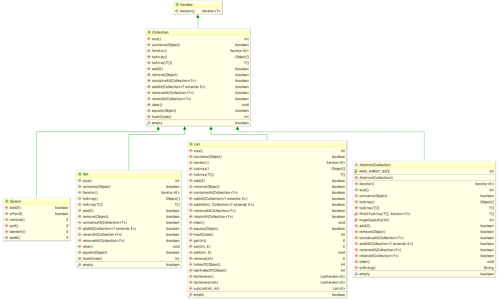
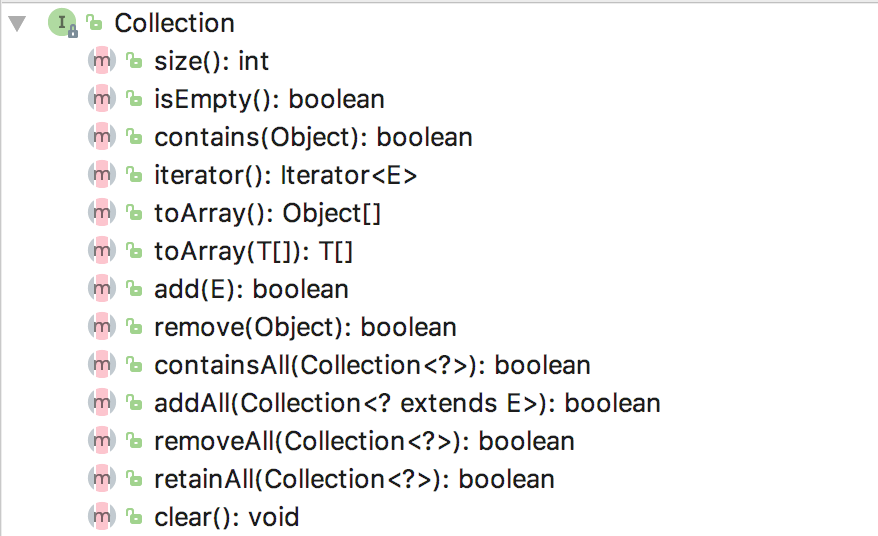

1 分析Collection接口以及其子接口，很通俗的方式说说，究竟有哪些类型的Collection，各自解决什么样的问题
Collection 接口关系如图   
   
三个子接口分别是: Queue、Set、List,还有一个抽象类 AbstractCollection,
Collection 接口抽象了一组元素的集合，提供了通用的集合操作方法
    

其中 Set 代表无序，不可重复的集合; List 代表有序，可重复的集合; Queue 代表一种队列集合。

AbstractCollection 是一个抽象类，它实现了 Collection 中除 iterator() 和 size() 之外的函数。
AbstractCollection 的主要作用：它实现了 Collection 接口中的大部分函数。从而方便其它类实现Collection，比如ArrayList、LinkedList等，它们这些类想要实现Collection接口，通过继承AbstractCollection就已经实现了大部分的接口了。   

   
2 TreeSet继承了什么Set，与HashSet的区别是？HashSet与HashTable是“一脉相承”的么？
3 Queue接口增加了哪些方法，这些方法的作用和区别是？
4 LinkedList也是一种Queue么？是否是双向链表?
5 Java数组如何与Collection相互转换
6 Map的一级子接口有哪些种类，分别用作什么目的？
7 HashSet 与HashMap中放入的自定义对象必须要实现哪些方法，说明原因
8 TreeSet里的自定义对象必须要实现什么方法，说明原因
9 LinkedHashMap使用什么来保存数据，其效率与HashMap相比如何？它又有什么独特特性
10 IdentityHashMap 里面如果按照下面的方法放入对象，分别是什么结果，请解释原因
        Integer a=5;
        Integer b=5;
        map.put(a,"100");
        map.put(b,"100";
        System.out.println(map.size);
        map.clear();
       Integer a=Integer.MAX_VALUE-1;
       Integer b=Integer.MAX_VALUE-1;
       map.put(a,"100");
        map.put(b,"100";
        System.out.println(map.size);

加分题，
给出ＪＤＫ　１.８的java 集合框架全图谱（Class类图）， 并标明1.7与1.8里出现的新的类，解释其目的

[Java 集合系列02之 Collection架构](http://www.cnblogs.com/skywang12345/p/3308513.html#a4)