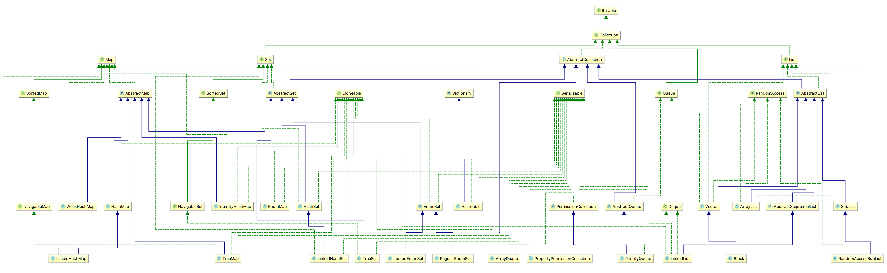

1 分析Collection接口以及其子接口，很通俗的方式说说，究竟有哪些类型的Collection，各自解决什么样的问题
Collection 接口关系如图   
   
三个子接口分别是: Queue、Set、List,还有一个抽象类 AbstractCollection,
Collection 接口抽象了一组元素的集合，提供了通用的集合操作方法
    

* 其中 Set 代表无序，不可重复的集合，就像是一个盘子里的小石头，每个都一样是石头，但是每一个形状又都不一样，Set 的 API 和 Collection 完全一样;      
* List 代表有序，可重复的集合，List中的每一个元素都有一个索引；第一个元素的索引值是0，往后的元素的索引值依次+1，对比 Collection，List 拓展了自己的方法，增加了 “添加、删除、获取、修改指定位置的元素”、“获取List中的子队列” 等方法;    
    
* Queue 代表一种队列集合，队列的头部保存在队列中存放时间最长的元素，尾部保存存放时间最短的元素。新元素插入到队列的尾部，取出元素会返回队列头部的元素，对比 Collection 接口，Queue 增加了"队尾元素插入"，"获取队头元素" 等方法
  
* AbstractCollection 是一个抽象类，它实现了 Collection 中除 iterator() 和 size() 之外的函数。
AbstractCollection 的主要作用：它实现了 Collection 接口中的大部分函数。从而方便其它类实现Collection，比如ArrayList、LinkedList等，它们这些类想要实现Collection接口，通过继承AbstractCollection就已经实现了大部分的接口了。   

   
2 TreeSet继承了什么Set，与HashSet的区别是？HashSet与HashTable是“一脉相承”的么？
TreeSet 和 HashSet 类图如下:
 
 可以看到，TreeSet 和 HashSet 都继承了 AbstractSet，都实现了 Serializable、Cloneable 接口，所以可以说HashSet与HashTable是“一脉相承”的，但是对于 HashSet 来说，TreeSet 实现了 NavigableSet、SortedSet 接口
 SortedSet 具有排序功能，它支持对 Set 中的元素排序，提供了三大功能，分别是
 
 ```
 public interface SortedSet<E> extends Set<E> {
    // Range-view 范围查看 
    SortedSet<E> subSet(E fromElement, E toElement);
    SortedSet<E> headSet(E toElement);
    SortedSet<E> tailSet(E fromElement);

    // Endpoints  端点
    E first();
    E last();

    // Comparator access  访问 Comparator
    Comparator<? super E> comparator();
}
 ```
 
 NavigableSet  直译成中文就是：可导航的 Set,是 SortedSet 的子接口，有 ConcurrentSkipListSet, TreeSet 两种实现       
增加了返回小于（lower）、小于等于（floor）、大于等于（ceiling）和大于（higher）输入参数的一个元素的方法     
弹出第一个(pollFirst)，最后一个元素(pollLast)、    
以及正向和逆向的迭代器、     
返回更小的元素集合(headSet)，更大的元素集合(tailSet)，区间元素集合(subSet)
 
 
3 Queue接口增加了哪些方法，这些方法的作用和区别是？    
Queue 本质上是一个操作受限的集合，结构图如下：   
    
  
```
 offer       添加一个元素并返回插入结果,优于add，因为如果队列已满，则返回false，不抛出异常  
 remove   	 移除并返回队列头部的元素， 如果队列为空，则抛出一个异常   
 poll        移除并返问队列头部的元素，优于remove,因为如果队列为空，则返回null   
 element     返回队列头部的元素，如果队列为空，则抛出一个异常      
 peek        返回队列头部的元素，优于peek,因为如果队列为空，则返回null       
```
 
4 LinkedList也是一种Queue么？是否是双向链表?     
LinkedList 实现了 Queue 接口，所以可以作为队列，作为 FIFO 的队列时，下表的方法等价：

队列方法 | 	等效方法
---- | ----
add(e) |	addLast(e)
offer(e) | offerLast(e)
remove() | removeFirst()
poll()	| pollFirst()
element() | getFirst()
peek()	| peekFirst()

LinkedList 是双向链表实现，从下图可以看出，它分别记录了头节点和尾节点，便于双向遍历   
   
5 Java数组如何与Collection相互转换

Collection to Array:    
1. ```Bar[] result = foos.stream().map(Bar::new).toArray(Bar[]::new);```     
2. ```Foo[] foos = x.toArray(new Foo[x.size()]); ```   
3. 
 
```
int i = 0;   
Bar[] bars = new Bar[fooCollection.size()];
for( Foo foo : fooCollection ) { // where fooCollection is Collection<Foo>
    bars[i++] = new Bar(foo);
}    
``` 

Array to Collection:   
1. ```XXX xxx = new XXX(Arrays.asList(array));```   
2. ```Collections.addAll(list, array); ```  
3. ```XXX xxx = Arrays.stream(array).collect(Collectors.toXXX());``` 

6 Map的一级子接口有哪些种类，分别用作什么目的？  
下图为 Map 实现类和子接口 
   
子接口有：   
Bindings,      不明
ConcurrentMap<K,V>,   定义了几个基于 CAS（Compare and Set）操作
MessageContext,   不明     
ObservableMap,   允许注册观察者跟踪 Map 值的更改   
SortedMap<K,V>    可进行排序的 Map    
XSNamedMap,      为内部使用的接口，不明   
7 HashSet 与HashMap中放入的自定义对象必须要实现哪些方法，说明原因       
如果要将自定义的对象放入到HashMap或HashSet中，需要@Override hashCode()和equals()方法。hashCode()方法决定了对象会被放到哪个bucket里，当多个对象的哈希值冲突时，equals()方法决定了这些对象是否是“同一个对象”。    
8 TreeSet里的自定义对象必须要实现什么方法，说明原因       
因为 TreeSet 具有排序功能，所以对象集合必须实现Comparable接口,并重写compareTo()方法，通常我们需要保持 compareTo 和 equals 同步，所以最好也实现 equalse 方法    
9 LinkedHashMap使用什么来保存数据，其效率与HashMap相比如何？它又有什么独特特性   
LinkedHashMap 继承了 HashMap ，所以底层使用了数组来保存数据，用 set 来保存 key 集合，但是它又新增了 head 和 tail 实现双向循环链表，下面是开销情况：
      
对比 HashMap Hash的无序性，LinkedHashMap 的元素可以按插入顺序或访问顺序排列                        

10 IdentityHashMap 里面如果按照下面的方法放入对象，分别是什么结果，请解释原因

```
        Integer a=5;
        Integer b=5;
        map.put(a,"100");
        map.put(b,"100";
        System.out.println(map.size);
        map.clear();
       Integer a=Integer.MAX_VALUE-1;
       Integer b=Integer.MAX_VALUE-1;
       map.put(a,"100");
        map.put(b,"100";
        System.out.println(map.size);
```
        
结果如图:
   
原因是：是 IdentityHashMap 使用的是==比较key的值，调用 Integer.valueOf, 当值小于 127 时，返回的都是 IntegerCache 的值，所以 IdentityHashMap 认为它是同一个 key ，128 开始就返回一个新的 Integer, IdentityHashMap就认为不相等了    

加分题，
给出ＪＤＫ　１.８的java 集合框架全图谱（Class类图）， 并标明1.7与1.8里出现的新的类，解释其目的     
下图为集合框架（非并发）


* Iterator。它是遍历集合的工具，我们经常使用Iterator迭代器来遍历集合。Collection的实现类都要实现iterator()函数，返回一个Iterator对象。
* Collection是一个interface    
	Collection有List、Set和Queue三大分支。

   - List<E>是一个队列，根据下标索引，第一个元素的下标是0，List的实现类有LinkedList, ArrayList, Vector, Stack。List是有序的队列，List中可以有重复的值。

   - Set<E>是一个集合，SET中的值是唯一的，我们经常会遇到List去重的问题，把List转为SET就可以快速实现 Set的实现类有HastSet和TreeSet。HashSet。其中TreeSet是有序的。
   - Queue 代表一种队列集合，队列的头部保存在队列中存放时间最长的元素，尾部保存存放时间最短的元素。新元素插入到队列的尾部，取出元素会返回队列头部的元素   
* Map<K,V>是一个interface，即key-value键值对。Map中的每一个元素包含“一个key”和“key对应的value”。 
  - AbstractMap是个抽象类，它实现了Map接口中的大部分API。而HashMap，TreeMap，WeakHashMap都是继承于AbstractMap。
* 抽象类AbstractCollection、AbstractList、AbstractSet、AbstractMap是抽象类，他们都实现了各自的大部分方法，我们直接继承Abstract类就可以省去重复编码相同的方法

* List简介  
 1. List 是一个接口，它继承于Collection的接口。它代表着有序的队列。
 2. AbstractList 是一个抽象类，它继承于AbstractCollection。AbstractList实现List接口中除size()、get(int location)之外的函数。
 3. AbstractSequentialList 是一个抽象类，它继承于AbstractList。AbstractSequentialList 实现了“链表中，根据index索引值操作链表的全部函数”。 
 4. ArrayList, LinkedList, Vector, Stack, 是List的4个实现类,RandomAccessSubList是内部类。

* Map体系
 1. Map 是映射接口，Map中存储的内容是键值对(key-value)。
 2. AbstractMap 是继承于Map的抽象类，它实现了Map中的大部分API。其它Map的实现类可以通过继承AbstractMap来减少重复编码。
 3. SortedMap 是继承于Map的接口。SortedMap中的内容是排序的键值对，排序的方法是通过比较器(Comparator)。
 4. NavigableMap 是继承于SortedMap的接口。相比于SortedMap，NavigableMap有一系列的导航方法；如"获取大于/等于某对象的键值对"、“获取小于/等于某对象的键值对”等等。 
 5. TreeMap 继承于AbstractMap，且实现了NavigableMap接口；因此，TreeMap中的内容是“有序的键值对”， 它是通过红黑树实现的。它一般用于单线程中存储有序的映射。
 6. HashMap 继承于AbstractMap，没实现SortedMap或NavigableMap接口；因此，HashMap的内容是无序的键值对。
 7. LinkedHashMap 继承于HashMap，LinkedHashMap 的元素可以按插入顺序或访问顺序排列
 8. IdentityHashMap 是 1.4 版本新增的一种特殊的HashMap，还是用key的hashCode来决定entry的槽位，但是不用key的equals方法来决定是否相等了，而是默认使用地址（即使实现了equals，equals也不起作用）来决定是否相等
 9. EnumMap 是 1.5 版本新增的一种键为枚举类型的特殊的Map实现。所有的Key也必须是一种枚举类型，EnumMap是使用数组来实现的。
 7. Hashtable继承于Dictionary(Dictionary也是键值对的接口)，实现Map接口；因此，Hashtable的内容也是“键值对，是无序的”。 Hashtable是线程安全的。 
 8. WeakHashMap 继承于AbstractMap。它和HashMap的键类型不同，WeakHashMap的键是“弱键”， 当“弱键”被GC回收时，它对应的键值对也会被从WeakHashMap中删除。JVM提供的弱引用

* Set简介
 1. Set 是继承于Collection的接口。它是一个不允许有重复元素的集AbstractSet 是一个抽象类，它继承于AbstractCollection，AbstractCollection实现了Set中的绝大部分函数，为Set的实现类提供了便利。
 2. HashSet 和 TreeSet 是Set的两个实现类。HashSet中的元素是无序的。TreeSet中的元素是有序的，不支持快速随机遍历，只能通过迭代器进行遍历。  
 3. LinkedHashSet继承于 HashSet ,它以元素插入的顺序来维护集合的链接表，允许以插入的顺序在集合中迭代；  
 4. EnumSet 是 enum 值的集合。在 Java 中，每个 enum 都映射至一个 int 类型：每个 enum 值映射的 int 都互不相同。这使得 BitSet 之类的集合结构成为可能，每个 bit 都映射到一个不同的 enum 值。此类还存在两种实现——包含单个 long 类型（可存储64个 enum 值，足够覆盖99.9%的用例）的 RegularEnumSet 与包含 long[] 类型的 JumboEnumSet

* Queues(队列)/deques(双队列)
 1. AbstractQueue 是继承于Queue的抽象类，它实现了Queue中的大部分API。其它Queue的实现类可以通过继承AbstractQueue来减少重复编码
 2. PriorityQueue 继承 AbstractQueue ，是一个基于优先级堆的极大优先级队列。
 3. ArrayDeque 基于数组的双端队列   

并发的集合有点乱...

[Java 集合系列02之 Collection架构](http://www.cnblogs.com/skywang12345/p/3308513.html#a4)   
[Java HashSet和HashMap源码剖析](http://www.importnew.com/19892.html)   
[Difference between HashMap, LinkedHashMap and TreeMap](http://stackoverflow.com/questions/2889777/difference-between-hashmap-linkedhashmap-and-treemap)   
[Java 性能调优指南之 Java 集合概览](https://my.oschina.net/oneapmofficial/blog/673984)