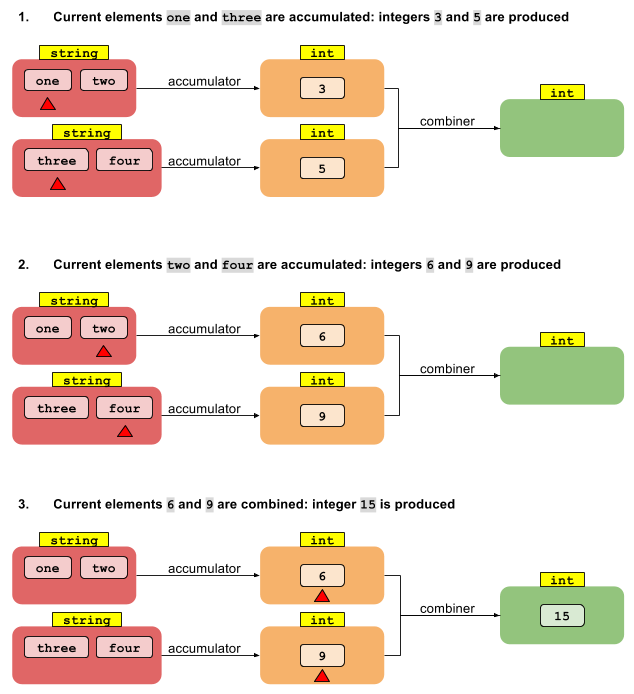

### 1 说明Stream 与Collection的区别 以及关系

 可从 Stream 的文档中找到答案     
  1. 无存储。流不是存储元素的数据结构,而是通过"计算操作的流水线"的形式表达来自诸如数据结构，阵列，生成器函数或 I/O 通道的源的元素。   
  2. 本质是函数。对 Stream 对象操作能得到一个结果，但是不会修改原始数据。   
  3. Laziness-seeking（延迟执行）：Stream 的很多操作如 filter、map、sort 和 duplicate  removal(去重）可以延迟实现，意思是我们只要检查到满足要求的元素就可以返回。   
  4. 可能是不受限制的（无限数量）：Streams 允许 Client 取足够多的元素直到满足某个条件为止。而 Collections 不能这么做。   
 5. 消耗的。Steam 中的元素在 steam 生存期内只能被访问一次。   
 
 Collection 可以作为 Stream 的数据源和输出结果，   
 Lambda 还有一个特点就是纯函数，所以执行过程中不要有副作用，只修改流数据本身而不改变其他数据，比如：使用 print 打印出来    
 ```高阶函数``` 接收另外一个函数作为参数、或者返回一个函数的函数   
 
###2 下面代码为什么输出流中的每个元素2遍

``` 
Stream.of("d2", "a2", "b1", "b3", "c")
    .filter(s -> {
        System.out.println("filter: " + s);
        return true;
    })
    .forEach(s -> System.out.println("forEach: " + s));
```
代码如下图：
   
filter 是中间操作，惰性求值，可以延迟执行，forEach 是终结操作，及早求值，会立即执行，所以 filter 和 forEach 里的操作会一起执行    
###3  用Stream的API实现第四题的结果，其中增加一个过滤条件，即年薪大于10万的才被累加，分别用ParellStream与普通Stream来运算，看看效果的差距
添加过滤条件:
    
添加一段 ParellStream 方式执行的代码
 
 
       
可以看出，盲目地加 ParellStream 并不能达到优化的效果，所以并行操作还需要根据实际情况进行测试并优化   
###4 自己动手编写不少于5个Stream的例子，并解释代码    
- 只用 reduce 和 Lambda 表达式实现 Stream 中的 map 操作
  
其中并行操作会慢的原因是因为并行操作有一个合并的步骤，所以数据量少的情况下会比较慢,图示如下:   
  
   
- 只用 reduce 和 Lambda 表达式实现 Stream 中的 filter 操作
  
- 对数据进行分组并计数
   
- 在一个字符串列表中找出包含最多小写字母的字符串   
    
- 统计文本中相同单词的数量
    

        
[Why is a combiner needed for reduce method that converts type in java 8](http://stackoverflow.com/questions/24308146/why-is-a-combiner-needed-for-reduce-method-that-converts-type-in-java-8)
          