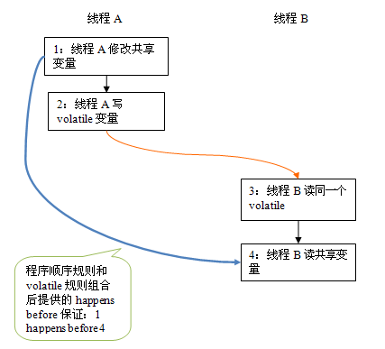

###1 解释下你所理解的Happens-before含义和JVM里的几个Happens-before约定   
答：为什么要在意内存可见性？因为 Java 的并发采用的是共享内存模型，Java 线程之间的通信是通过共享内存隐式进行的

JSR-133 使用 happens-before 的概念来阐述操作之间的内存可见性，JMM 中，如果一个操作执行的结果需要对另外一个操作可见，那么这两个操作之间必须要存在 happens-before 关系   

一个 happens-before 规则底层对应着一个或多个编译器和处理器重排序规则，帮助程序员避开复杂的重排序规则和实现      

####Java 中的 happens-before 关系    
- 程序顺序规则：一个线程中的每一个操作，对于线程中的的任意后续操作可见    
- 监视器锁规则：对一个锁的解锁，对于随后对这个锁的加锁操作可见   
- volatile 变量规则：对于一个 volatile 域的写，对于任意后续对这个 volatile 域的读可见（但是并不能保证同步）
- 传递性，如果 A 操作对于 B 操作可见，且 B 操作对于 C 操作可见，那么 A 操作对于 C 操作可见   
- start() 规则：如果线程 A 执行操作 ThreadB.start() ,那么 A 线程的 ThreadB.start() 操作对于线程 B 中的任意操作可见   
- join() 规则：如果线程 A 执行操作 ThreadB.join() 并成功返回,那么线程 B 中的任意操作对于线程 A 从 ThreadB.join() 操作成功返回可见   
- 对象终结规则：一个对象的初始化完成对于他的 finalize() 方法可见   
- 中断法则法则：一个线程调用另一个线程的 interrupt 方法对于被中断线程发现中断可见（通过抛出InterruptedException， 或者调用 isInterrupted 方法和 interrupted 方法）   

但是，如果两个操作之间具有 happens-before 关系，并不意味着一个操作必须要在后一个操作之前执行， happens-before 只是要求前一个操作的执行结果对于后一个操作可见，并且前一个操作按顺序排在第二个操作之前
例如：

```
int a = 1;        // A 
int b = 2;        // B
int c = a + b;    // C
```   
按照 **程序顺序规则**，这里存在三个 happens-before 关系

```
1. A happens-before B
2. B happens-before C
3. A happens-before C
```
正常情况下执行顺序是这样子的：```A->B->C``` ,结果为 3    
重排序后的执行顺序可能是这样子的： ```B->A->C``` ,结果为 3    
因为不改变执行结果，所以这种情况也是合法的，编译器和处理器会在不改变程序执行结果的前提下，尽可能提高并行度    

**volatile 变量规则**   

- 可见性:对于一个 volatile 变量的读，总能看到任意线程对这个 volatile 变量最后的写入   
- 原子性:对任意单个 volatile 变量的读写具有原子性，但类似于 volatile++ 这种复合操作不具有原子性    


###2 不依赖任何的同步机制（syncronized ,lock），有几种方式能实现多个线程共享变量之间的happens-before方式   
1. 使用 volatile 变量

 ```
class VolatileExample {
    int a = 0;
    volatile boolean flag = false;

    public void writer() {
        a = 1;                   //1
        flag = true;               //2
    }

    public void reader() {
        if (flag) {                //3
            int i =  a;           //4
            ……
        }
    }
}  
 ```     
假设线程 A 执行 writer() 方法之后，线程 B 执行 reader() 方法。根据 happens before 规则，这个过程建立的 happens before 关系可以分为两类：   
  
  - 根据程序次序规则，1 happens before 2; 3 happens before 4
  - 根据 volatile 规则，2 happens before 3
  - 根据 happens before 的传递性规则，1 happens before 4   
上述 happens before 关系的图形化表现形式如下：
    
在上图中，每一个箭头链接的两个节点，代表了一个 happens before 关系。黑色箭头表示程序顺序规则；橙色箭头表示 volatile 规则；蓝色箭头表示组合这些规则后提供的 happens before 保证。    
这里 A 线程写一个 volatile 变量后，B 线程读同一个 volatile 变量。A 线程在写volatile 变量之前所有可见的共享变量，在 B 线程读同一个 volatile 变量后，将立即变得对B线程可见。   

2. 使用 final 关键字实现   
  一个对象的final字段值是在它的构造方法里面设置的。假设对象被正确的构造了，一旦对象被构造，在构造方法里面设置给final字段的的值在没有同步的情况下对所有其他的线程都会可见。另外，引用这些final字段的对象或数组都将会看到final字段的最新值。   
  
     

###3 编程验证normal var ,volaitle，synchronize,atomicLong ,LongAdder，这几种做法实现的计数器方法，在多线程情况下的性能，准确度

    class MyCounter
    {
          private long value;//根据需要进行替换
          public void incr();
          public long getCurValue();//得到最后结果
    }  
启动10个线程一起执行，每个线程调用incr() 100万次，
所有线程结束后，打印 getCurValue()的结果，分析程序的结果 并作出解释。 用Stream和函数式编程实现则加分！

测试代码：


测试大体结果：


##选做题：
 
###1 自己画出Java内存模型并解释各个区，以JDK8为例，每个区的控制参数也给出。     
JVM中的内存分为5个虚拟的区域。如图：


### 2 解释为什么会有数组的Atomic类型的对象
因为如果不使用 AtomicXXXArray 的话就需要使用 AtomicXXX[] 来编程，但是 AtomicXXX[] 会对每一个元素都进行原子化，而 AtomicXXXArray 只是将 AtomicXXXArray 对象和一个 array 对象原子化     
对于普通的 array 内存边界检查的成本非常小，但是如果从多个处理器中访问同一高速缓存行中的数据会导致显著的性能问题，因此使用单独的 AtomicXXXArray 对象可以避免密集元素边界检查      
 
 [java8的JVM持久代——何去何从？](http://blog.csdn.net/yechaodechuntian/article/details/40341975)    
 [虚拟机规范](http://docs.oracle.com/javase/specs/jls/se8/jls8.pdf)