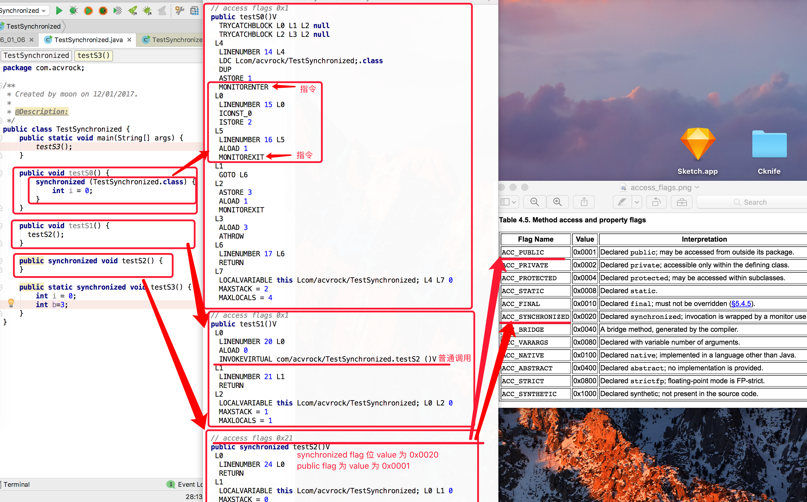
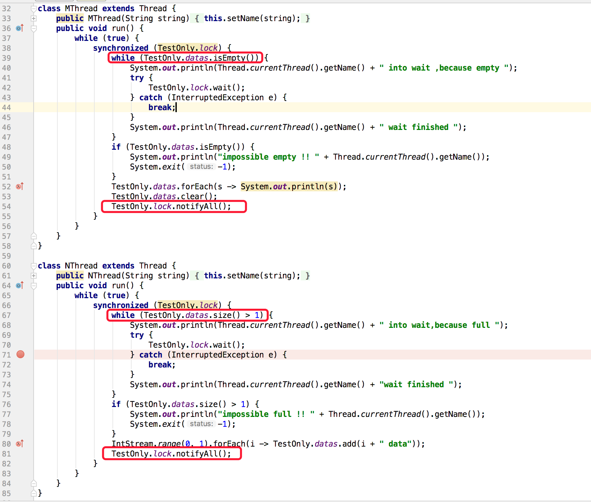
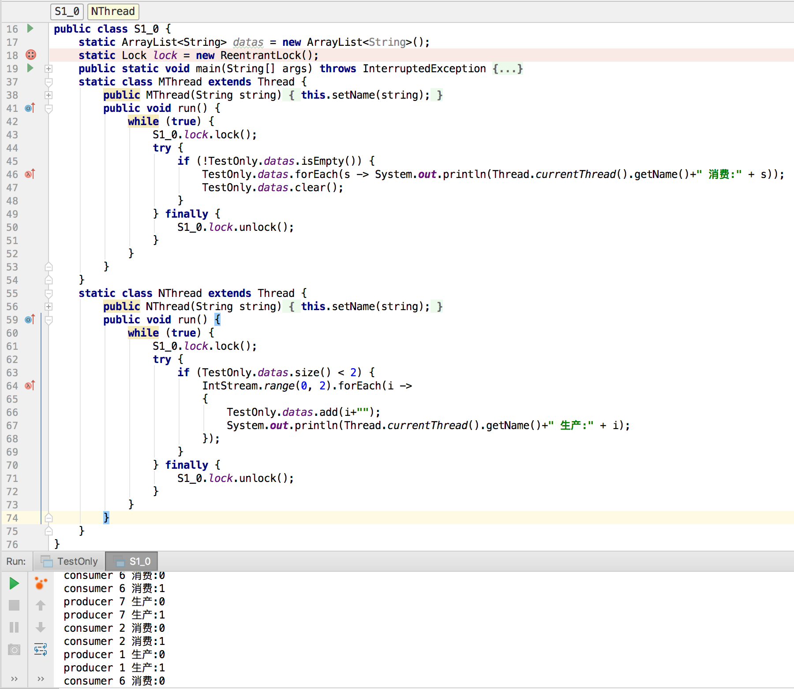
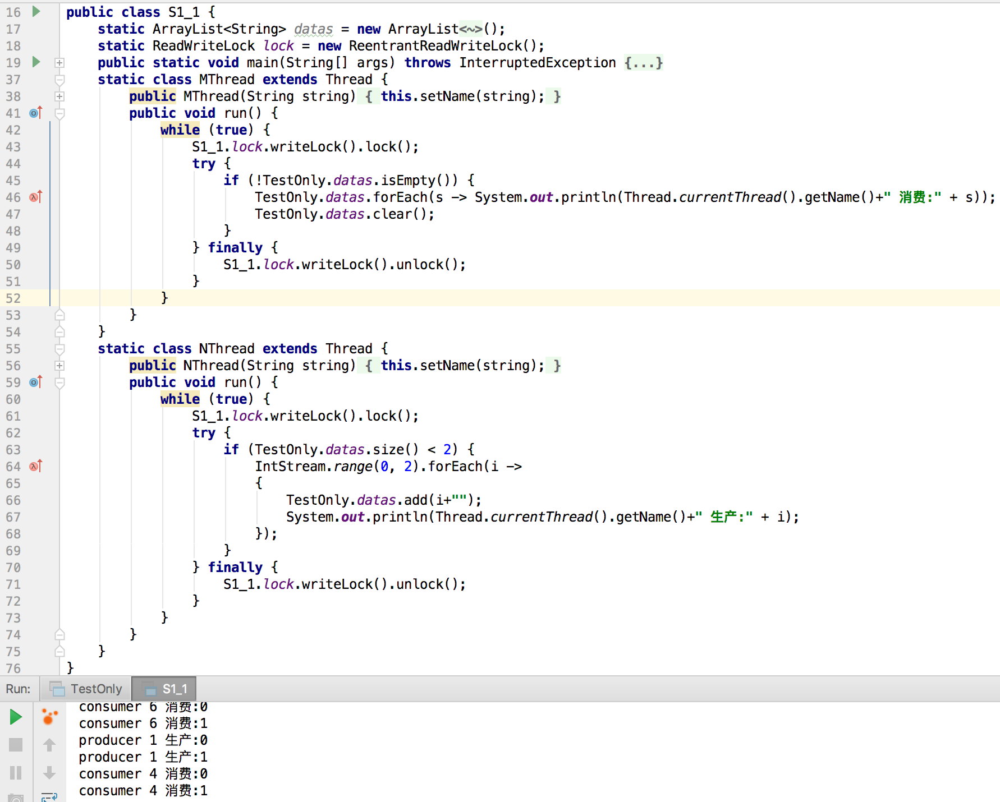

1 说说下面的几个方法，分别锁的是什么东西？

 public static synchronized void doIt(){xx};   
 pubilc  syncronzied void doIt() {xxx)   
 pubilc void doIt(){ syncronized(myobj) ....}   
 
答：    

1. 静态方法 synchronized:锁住当前类的 Class（注意是大写的） 对象      
静态方法前加 synchronized ，等价于锁住了该类的 Class 对象，相当于 synchronized(T.class),因为正常情况下 PermGen 区只会存在一个该类的 Class 对象，因此静态方法锁相当于该类的一个全局锁，作用域为该方法，互斥条件为：           

  - 代码中任意地方发生了 synchronized(T.class)   
  - 在给类的所有静态方法前面增加 synchronized 关键字    

2. 普通方法 synchronized:相当于 syncronized(this) ,锁住的便是对象实例（this）,作用域为该方法,互斥条件有三：

  - 该类的所有非静态方法中发生 syncronized(this)  
  - 在给类的所有非静态方法前面添加 synchronized 关键字  
  - 在其他类中得到该类实例对象的应用，并对该对象进行 synchronized 操作   
   
3. synchronized 代码块:锁住的对象同 2，锁住的便是对象实例（myobj），但是作用域为大括号内的代码块,除此之外，synchronized 代码块和 synchronized 方法还有 JVM 实现上的差别：   

 - synchronized 语句被 javac 编译成 bytecode 时，会在同步块的入口位置和退出位置分别插入 monitorenter 和 monitorexit 字节码指令。
 - synchronized 方法被 javac 编译成 bytecode 时，会被翻译成普通的方法调用和返回指令如: invokevirtual、areturn 指令，在 VM 字节码层面并没有任何特别的指令来实现被 synchronized 修饰的方法，而是在 Class 文件的方法表中将该方法的 access_flags 字段中的 synchronized 标志位置1，表示该方法是同步方法并使用调用该方法的对象或该方法所属的 Class 在 JVM 的内部对象表示 Klass 做为锁对象。   

如下图：

 2 说说为什么下面的代码是错误的
 public void doIt() { syncronized(new ObjA()) {xxxx}
 
 因为 synchronized 锁的都是对象，new ObjA() 每次都会产生一个新对象，所以不能正确得加锁   
 PS:在 Web 开发中，经常有需要锁住某个从前端传入的资源 ID 的情况，因为 synchronized 锁的都是对象，判断对象是否相同使用的是 == 判断，但是在 -128 至 127 之间的 Integer 对象是在 IntegerCache.cache 产生，会复用已有对象，这个区间内的 Integer 值可以直接使用 == 进行判断，所以会造成用 synchronized 成功锁住了不同线程传入 Integer 对象的假象,所以需要避免      为了减少 synchronized 的影响范围，可以使用 synchronized (string.intern())   

 
 3 说说下面的代码为什么是错误的
 
 public void doIt() {synchrnized(myobj) { if(xxx) { myobjA.wait();}...}
 
 答:因为   
 
 1. 任何一个时刻，对象的控制权（monitor）只能被一个线程拥有。
 2. 无论是执行对象的wait、notify还是notifyAll方法，必须保证当前运行的线程取得了该对象的控制权（monitor）
 3. 如果在没有控制权的线程里执行对象的以上三种方法，就会报java.lang.IllegalMonitorStateException异常。

  
4 将05作业-TestOnly.java 中的代码中的错误一一修订，并确保其永远执行成功   
 修改四处   
 
 
 
加分题
1 用Lock方式与ReaWriteLock方式 对第四题进行改进，并说明思路    

2 用多线程方式实现第二课的第四题，其中计算线程数为8个，可能的思路：
       文件的总记录读取后分为8份，每个线程处理一份，所有线程都完成后，再累计汇总，输出结果
       
       