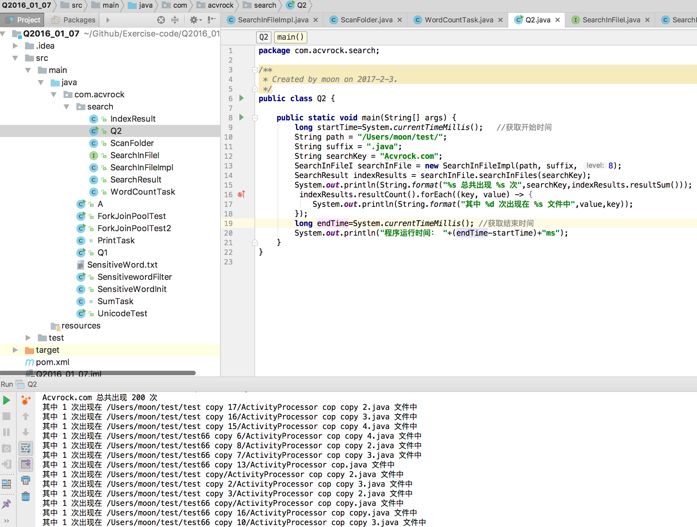
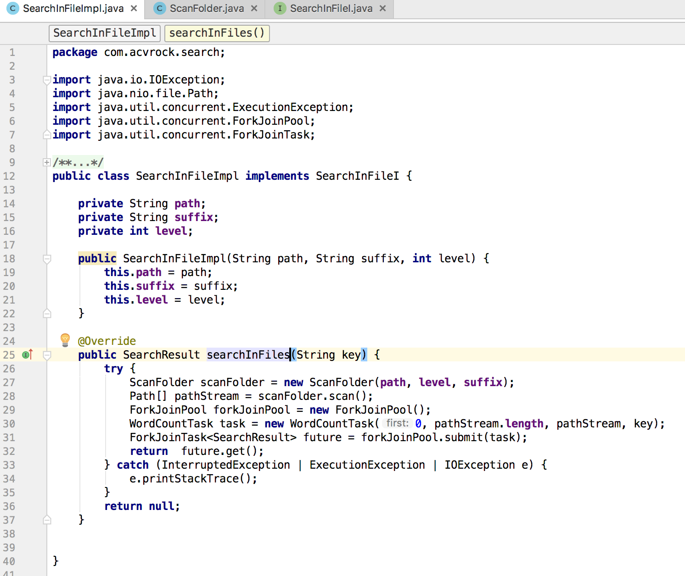
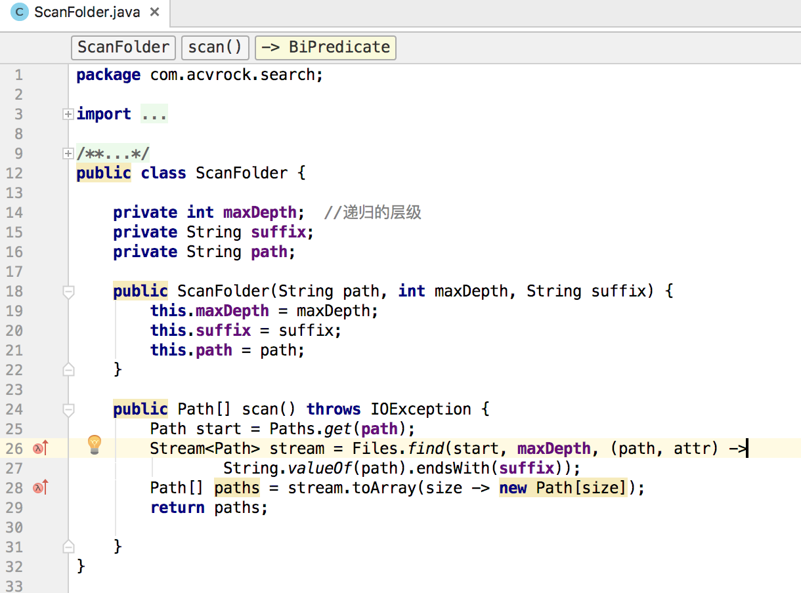
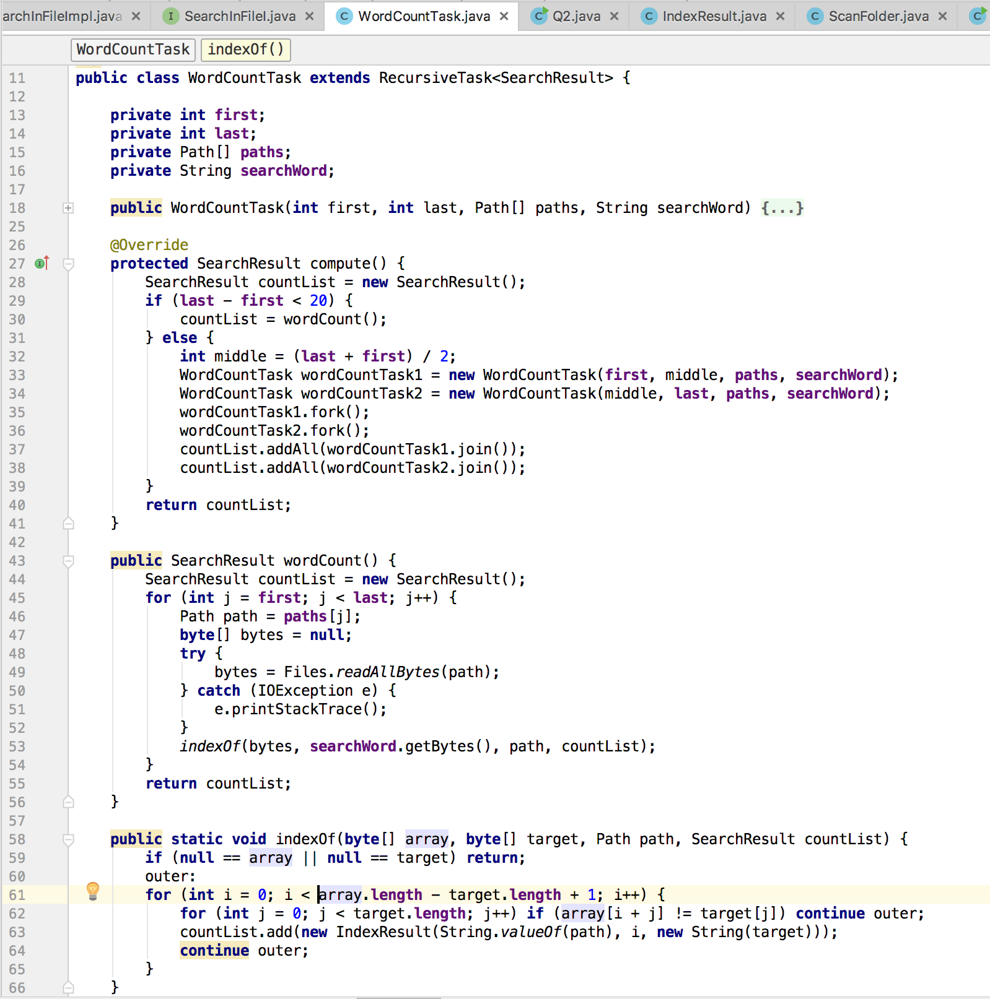
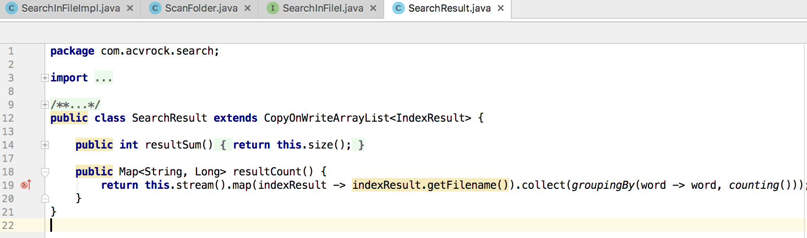
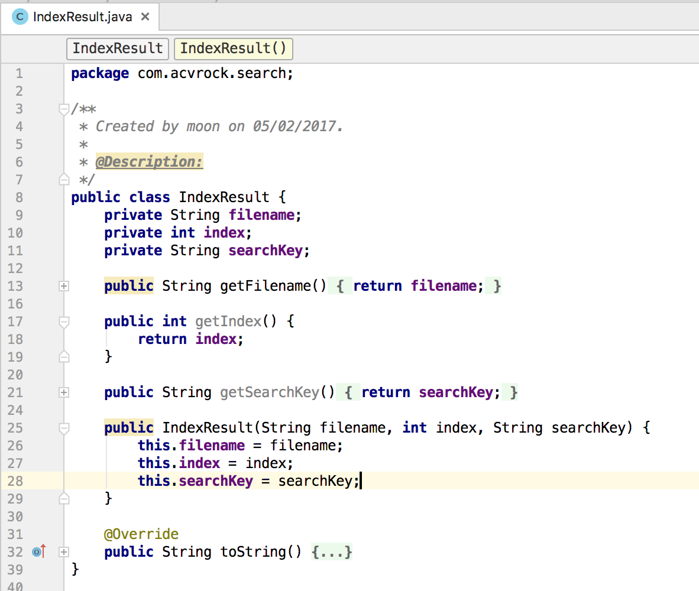

##1 解释为什么下面放入会失败
	SynchronousQueue<String> queue=new SynchronousQueue();
	if(queue.offer("S1"))
	{
		System.out.println("scucess");
	}else
	{
		System.out.println("faield");
	}
	
	
#### Java 6 的并发编程包中的SynchronousQueue是一个没有数据缓冲的BlockingQueue，生产者线程对其的插入操作put必须等待消费者的移除操作take，反过来也一样。
不像ArrayBlockingQueue或LinkedListBlockingQueue，SynchronousQueue内部并没有数据缓存空间，你不能调用peek()方法来看队列中是否有数据元素，因为数据元素只有当你试着取走的时候才可能存在，不取走而只想偷窥一下是不行的，当然遍历这个队列的操作也是不允许的。队列头元素是第一个排队要插入数据的线程，而不是要交换的数据。数据是在配对的生产者和消费者线程之间直接传递的，并不会将数据缓冲数据到队列中。可以这样来理解：生产者和消费者互相等待对方，握手，然后一起离开。   
其中 offer() 方法往queue里放一个element后立即返回，如果碰巧这个element被另一个thread取走了，offer方法返回true，认为offer成功；否则返回false，因为没有其他消费者线程在消费 element，所以必定会返回false
	
##2  用线程池框架或者fork-jion框架实现一个并发的文件内容查找接口：

public SearchResult searchInFiles(String key);
查询指定目录下的所有txt或者java文件（建议查找Java工程文件）
目录递归最多为4层，即从根目录开始，最多3层子目录中的文件搜索
每个文件中如果出现关键字，则关键字的次数+1，并且将此文件的路径也保持到List中
文件中出现关键字最多次的文件排名第一，以此类推：
屏幕最后输出：
xxx总共出现N次，
其中 2次出现在yyy文件中
3次出现在xxx文件中
 
 
  
 
 
 
 
