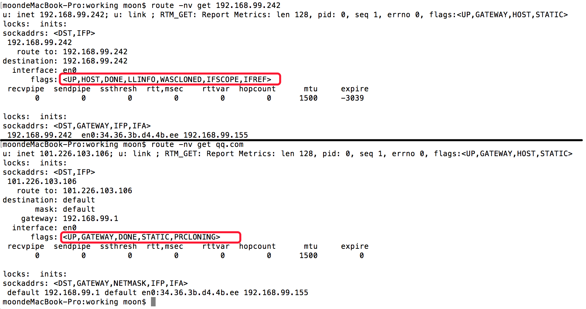
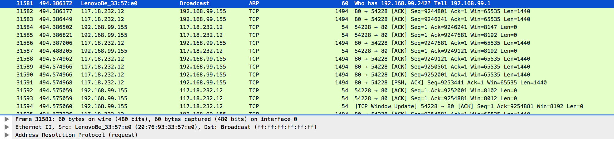
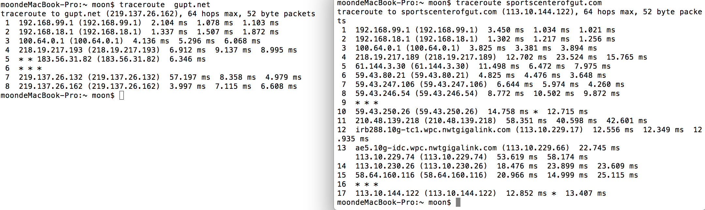
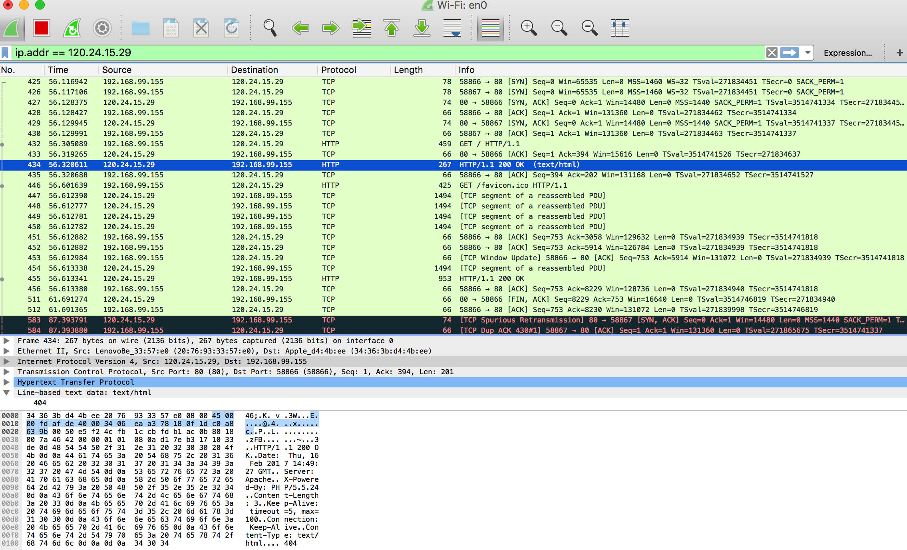

##1. 电脑跟外网的网站通讯的时候，是把数据报文直接发给谁的？   

 *  当一个主机 A 试图与另一个主机 B 通信时，IP 层实现判断两主机是否在同一个网段内，如果在同一网段，则直接在本网络内查找这台机器的 MAC 地址,如果以前两机有过通信，在 A 机的ARP（地址映射协议，将 IP 地址转化为 MAC 地址）缓存表可能会有 B 机 IP 与其 MAC 的映射关系，如果没有，就发一个 ARP 请求广播（向本网内所有主机发送）“x.x.x.x的MAC地址是什么”，这个广播所有主机都能收到，但是只有B才回应，发送自己的 MAC 地址，得到 B 机的 MAC 地址后，网卡驱动程序，将 IP 包添加 14 字节的 MAC 包头，构成 MAC 包，网卡芯片对 MAC 包，再次封装成物理帧，添加头部同步信息和 CRC 校验。然后丢到网线上，就完成一个 IP 报文的发送。所有挂接到本网线的网卡都可以看到该物理帧。 
 *  当主机 A 和 B 不在同一网段内时，A 将查询路由表来为外网主机或外网选择一个路由，所以一般情况下有可能为某个外网指定特定的路由，如果没有找到明确的路由，此时在路由表中还会有默认网关，A 取得网关的 MAC 地址，由该网关再次为远程主机或网络查询路由，若还未找到路由，该数据包将发送到该路由器的缺省网关地址，如此层层查找，直到将消息转发到目的地。 而对主机来说，其中的过程都由网络设备完成，主机只要将数据发送到自己的网关，剩下的事情就交给网络设备了

 在一个局域网内，用 route 命令打印出来的路由表通常只包括局域网内的 IP，直接发送到对方主机，局域网外的全都发到默认网关。数据包到了网关后再通过 ADSL 到电信的网络里，就可以在整个互联网自动路由，找到最优的路径到达目标 IP。通过 tracert 命令可以看到所有经过的路由器。 
 
  同一网段和不同网段的路由表情况，网关为 192.168.99.1：
  
  ARP 广播询问 MAC 地址
  
  主机 A 到主机 B 经过的路由
  

http://blog.sina.com.cn/s/blog_64d0b03c01015aek.html   
http://blog.csdn.net/yusiguyuan/article/details/12750541   
链接：https://www.zhihu.com/question/19572368/answer/13293212   
链接：https://www.zhihu.com/question/19572368/answer/13039635   
http://www.ruanyifeng.com/blog/2012/06/internet_protocol_suite_part_ii.html   
https://www.freebsd.org/doc/zh_CN.UTF-8/books/handbook/network-routing.html   

##2. 解释下访问一个外网域名网页的过程中，都先后发生了哪些网络通讯过程   

从应用层角度看主要做两件事情：通过 DNS 查询 IP、通过 Socket 发送数据   
DNS可以使用 UDP 和 TCP；DNS 协议要求客户端先使用 UDP 进行查询，若响应数据超过 512 字节，则可再次使用 TCP 进行查询得到完整响应

可以看到这是一个逐步缩小范围的查找过程，首先由默认的 DNS 服务器向 DNS 根节点查询负责 .com 区域的域务器，然后通过其中一个负责 .com 的服务器查询负责 acvrock.com 的服务器，最后由其中一个 acvrock.com 的域名服务器查询 blog.acvrock.com 域名的地址。
下图为通过 Socket 发送数据抓包情况   

##3. DNS解析与主机的Host文件有什么关系   

Hosts 文件内容：

在进行 DNS 请求以前，系统会先检查自己的 Hosts 文件中是否有这个地址映射关系，如果有则调用这个 IP 地址映射，如果没有再向已知的 DNS 服务器提出域名解析。
Hosts 的请求级别比 DNS 高。

##4. Ping是TCP还是UDP，或者是其他？其报文和过程是怎样的   
ping 程序是用来探测主机到主机之间是否可通信，如果不能 ping 到某台主机，表明不能和这台主机建立连接。ping 使用的是 ICMP 协议，它发送 ICMP 回送请求消息给目的主机。ICMP 协议规定：目的主机必须返回 ICMP 回送应答消息给源主机。如果源主机在一定时间内收到应答，则认为主机可达。
ping 过程：

## 选做题
### 了解TCP三次握手过程，并分享精彩PPT

- 第一次握手：建立连接。客户端发送连接请求报文段，将 SYN 位置为 1，Sequence Number为 x；然后，客户端进入 SYN_SEND 状态，等待服务器的确认；
- 第二次握手：服务器收到 SYN 报文段。服务器收到客户端的 SYN 报文段，需要对这个 SYN 报文段进行确认，设置 Acknowledgment Number 为 x+1(Sequence Number+1)；同时，自己自己还要发送 SYN 请求信息，将 SYN 位置为 1，Sequence Number 为 y；服务器端将上述所有信息放到一个报文段（即SYN+ACK报文段）中，一并发送给客户端，此时服务器进入 SYN_RECV 状态；
- 第三次握手：客户端收到服务器的 SYN+ACK 报文段。然后将 Acknowledgment Number 设置为y+1，向服务器发送 ACK 报文段，这个报文段发送完毕以后，客户端和服务器端都进入 ESTABLISHED状态，完成 TCP 三次握手。

http://www.jellythink.com/archives/705