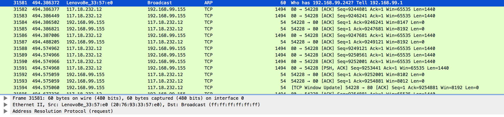
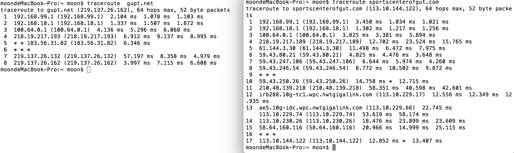
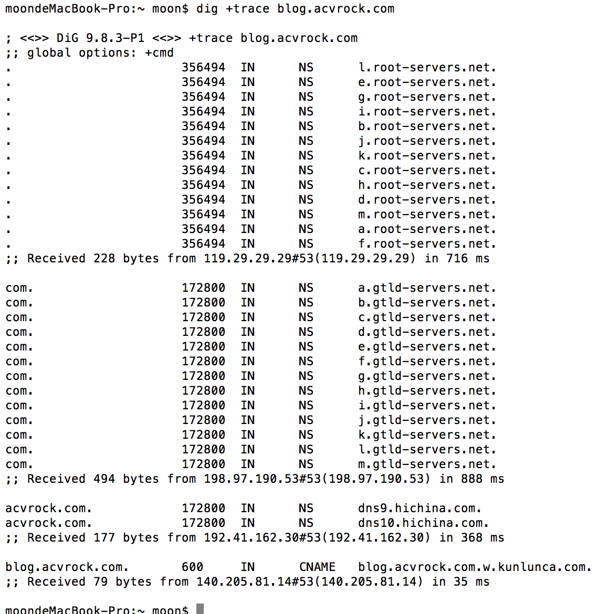
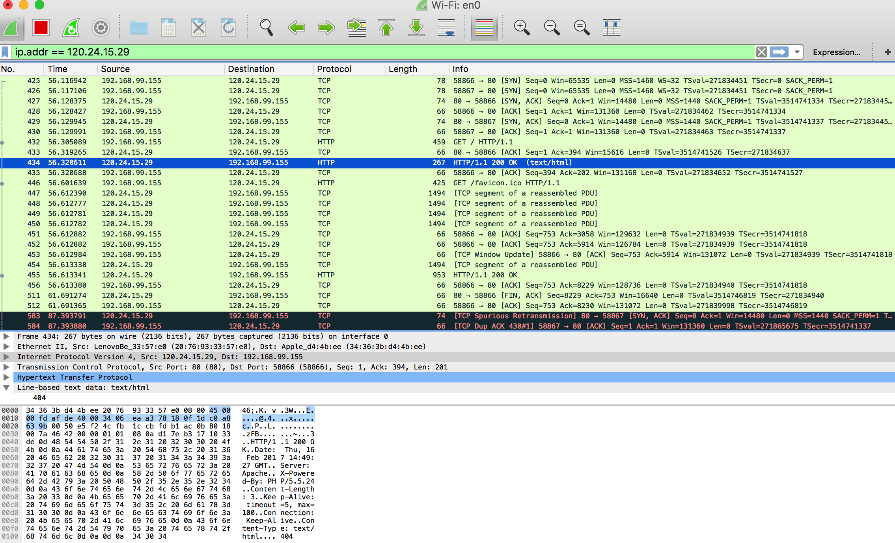

1. 电脑跟外网的网站通讯的时候，是把数据报文直接发给谁的？   

 *  当一个主机 A 试图与另一个主机 B 通信时，IP 层实现判断两主机是否在同一个网段内，如果在同一网段，则直接在本网络内查找这台机器的 MAC 地址,如果以前两机有过通信，在 A 机的ARP（地址映射协议，将 IP 地址转化为 MAC 地址）缓存表可能会有 B 机 IP 与其 MAC 的映射关系，如果没有，就发一个 ARP 请求广播（向本网内所有主机发送）“x.x.x.x的MAC地址是什么”，这个广播所有主机都能收到，但是只有B才回应，发送自己的MAC地址，得到B机的MAC 地址后，网卡驱动程序，将IP包添加14字节的MAC包头，构成MAC包，网卡芯片对 MAC包，再次封装成物理帧，添加头部同步信息和CRC校验。然后丢到网线上，就完成一个IP报文的发送。所有挂接到本网线的网卡都可以看到该物理帧。 
 *  当主机 A 和 B 不在同一网段内时，A 将查询路由表来为外网主机或外网选择一个路由，所以一般情况下有可能为某个外网指定特定的路由，如果没有找到明确的路由，此时在路由表中还会有默认网关，A 取得网关的 MAC 地址，由该网关再次为远程主机或网络查询路由，若还未找到路由，该数据包将发送到该路由器的缺省网关地址，如此层层查找，直到将消息转发到目的地。 而对主机来说，其中的过程都由网络设备完成，主机只要将数据发送到自己的网关，剩下的事情就交给网络设备了

 由于你在一个局域网内，用route PRINT打印出来的路由表通常只包括局域网内的直接发到网卡，其他的全都发到默认网关。数据包到了网关后再通过ADSL到电信的网络里，就可以在整个互联网内转悠，找到最优的路径到达目标IP。通过tracert命令可以看到所有经过的路由器。 
 
  同一网段和不同网段的路由表情况：
  
  ARP 广播询问 MAC 地址
  
  主机 A 到主机 B 经过的路由
  

http://blog.sina.com.cn/s/blog_64d0b03c01015aek.html
http://blog.csdn.net/yusiguyuan/article/details/12750541
链接：https://www.zhihu.com/question/19572368/answer/13293212
链接：https://www.zhihu.com/question/19572368/answer/13039635
http://www.ruanyifeng.com/blog/2012/06/internet_protocol_suite_part_ii.html
https://www.freebsd.org/doc/zh_CN.UTF-8/books/handbook/network-routing.html

2. 解释下访问一个外网域名网页的过程中，都先后发生了哪些网络通讯过程   

从应用层角度看主要做两件事情：通过 DNS 查询 IP、通过 Socket 发送数据
DNS 查询基于 UDP 来实现，

可以看到这是一个逐步缩小范围的查找过程，首先由默认的 DNS 服务器向 DNS 根节点查询负责 .com 区域的域务器，然后通过其中一个负责 .com 的服务器查询负责 acvrock.com 的服务器，最后由其中一个 acvrock.com 的域名服务器查询 blog.acvrock.com 域名的地址。
下图为通过 Socket 发送数据抓包情况   

3. DNS解析与主机的Host文件有什么关系   

4. Ping是TCP还是UDP，或者是其他？其报文和过程是怎样的   

### 选做题
了解TCP三次握手过程，并分享精彩PPT

- 第一次握手：建立连接。客户端发送连接请求报文段，将SYN位置为1，Sequence Number为x；然后，客户端进入SYN_SEND状态，等待服务器的确认；
- 第二次握手：服务器收到SYN报文段。服务器收到客户端的SYN报文段，需要对这个SYN报文段进行确认，设置Acknowledgment Number为x+1(Sequence Number+1)；同时，自己自己还要发送SYN请求信息，将SYN位置为1，Sequence Number为y；服务器端将上述所有信息放到一个报文段（即SYN+ACK报文段）中，一并发送给客户端，此时服务器进入SYN_RECV状态；
- 第三次握手：客户端收到服务器的SYN+ACK报文段。然后将Acknowledgment Number设置为y+1，向服务器发送ACK报文段，这个报文段发送完毕以后，客户端和服务器端都进入ESTABLISHED状态，完成TCP三次握手。

http://www.jellythink.com/archives/705