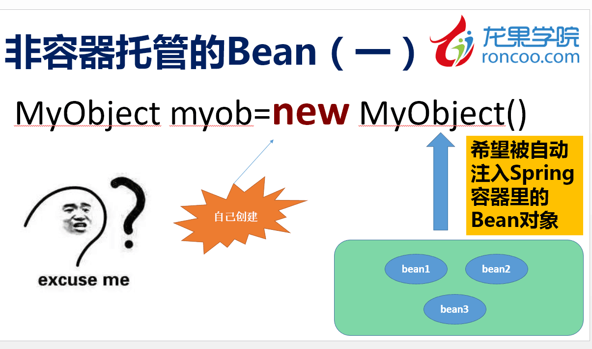
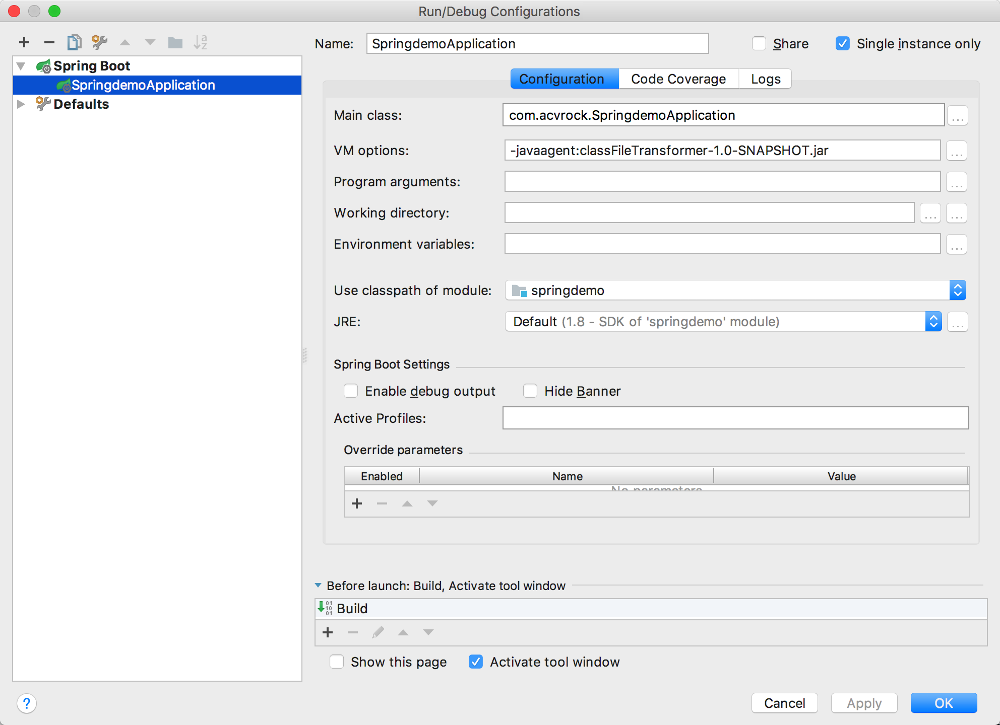
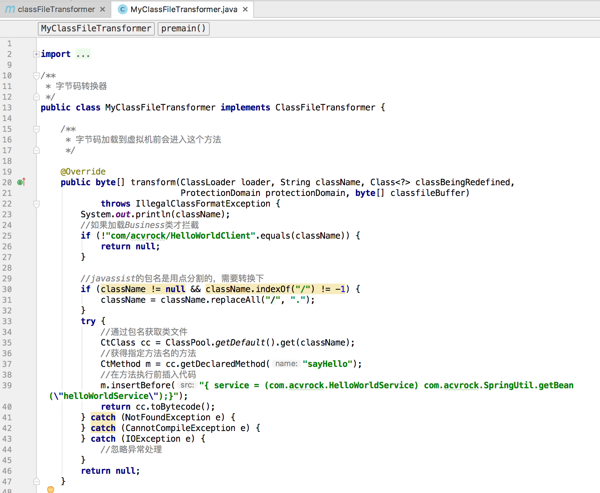
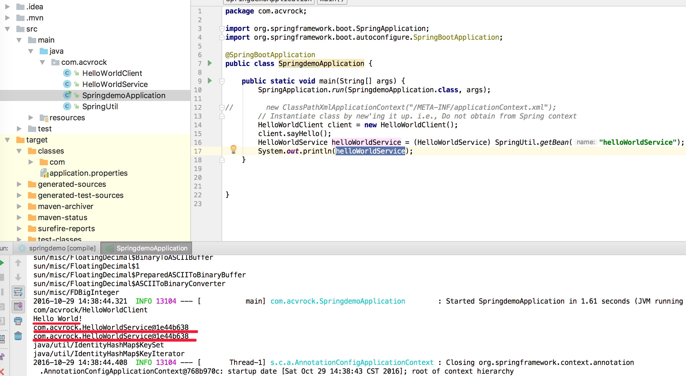

问题：


```

 HelloWorldService是被SPRING托管的Bean
public class HelloWorldService {
	
	public void sayHello() {
		System.out.println("Hello World!");
	}
}

HelloWorldClient依赖  
 HelloWorldService
public class HelloWorldClient {
 
	private HelloWorldService service;
	
	public void sayHello() {
	 
		service.sayHello();
	}
}


测试

public class HelloWorld {
	
	public static void main(String[] args) {
	 
		new ClassPathXmlApplicationContext("/META-INF/applicationContext.xml" );
		
		// Instantiate class by new'ing it up. i.e., Do not obtain from Spring context
		HelloWorldClient client = new HelloWorldClient();
		client.sayHello();
	}
}
```

参考：[ spring 之脱离容器管理创建的对象进行依赖注入](http://blog.csdn.net/doctor_who2004/article/details/46525361)

工程使用 Spring boot 搭建，运行参数：```-javaagent:classFileTransformer-1.0-SNAPSHOT.jar```

classFileTransformer-1.0-SNAPSHOT.jar的核心代码如下：

运行结果：
