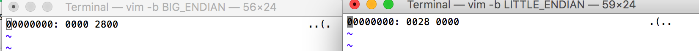
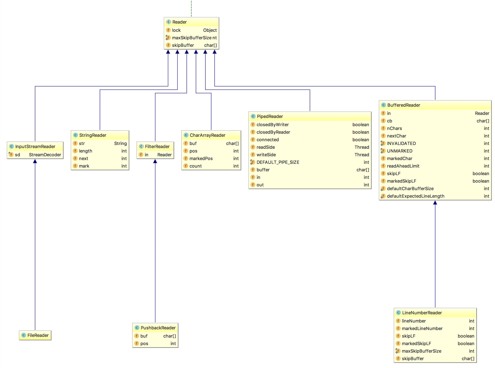

1  得到 String s="中国" 这个字符串的utf-8编码，gbk编码，iso-8859-1编码的字符串，看看各自有多少字节，同时解释为什么以utf-8编码得到的byte[]无法用gbk的方式“还原”为原来的字符串
 
 

```
同样为 中国 一词，
UTF-8 编码字节数组长度 6
GBK 编码字节数组长度 4
ISO-8859-1 编码字节数组长度 2

GBK编码表示为 [-42, -48, -71, -6]
UTF-8编码表示为 [-28, -72, -83, -27, -101, -67]
所以无法“还原”为原来的字符串
```


2 分别用大头和小头模式将整数 a=10240写入到文件中（4个字节），并且再正确读出来，打印到屏幕上，同时截图UltraEdit里的二进制字节序列，做对比说明

使用 vim 查看：


3 整理全套的Java IO类图并用PPT讲解说明   
java.io 包内的大部分与操作相关的成员都实现 **Closeable**  接口      
**Writer** 和 **OutputStream** 相关的成员都实现了 **Flushable** 接口      
中间夹杂了四个接口，分别是:**DataInput**、**ObjectInput**、**DataOutput**、**ObjectOutut** ,外加一个 **Console**  
定义相关的部分成员实现了 **Serialzable** 接口   
其中操作相关的成员有四大部分，分别是:

- **Reader**

- **InputStream**

- **Writer**

- **OutputStream**


定义相关的成员中，实现了 **Serialzable** 接口的有:  

* IOException 及其子类   
* FilePermission     
* FilePermissionCollection    
* IOError   
* File   
* ObjectStreamClass   
* SerializablePermission   
* Externalizable   
* UncheckedIOException   

没有实现 **Serialzable** 的有:   

* StreamTokenizer   
* FileSystem 及其子类   
* FileDescriptor   
* ObjectStreamField   
* ExpiringCache   
* SerialCallbackContext    
* DeleteOnExitHook    
* ObjectInputValidation    
* DefaultFileSystem     
* FilenameFilter    
* FileFilter    
* Bits    


4  随机生成 Salary {name, baseSalary, bonus  }的记录，如“wxxx,10,1”，每行一条记录，总共1000万记录，写入文本文件（UFT-8编码），
   然后读取文件，name的前两个字符相同的，其年薪累加，比如wx，100万，3个人，最后做排序和分组，输出年薪总额最高的10组：
         wx, 200万，10人
         lt, 180万，8人
         ....
 
  
         

加分题

1：用装饰者模式实现如下的功能：
     要求用户输入一段文字，比如 Hello Me，然后屏幕输出几个选项
       1 ：加密
       2 ：反转字符串
       3：转成大写
       4：转成小写
       5：扩展或者剪裁到10个字符，不足部分用！补充
       6:用户输入 任意组合，比如 1，3 表示先执行1的逻辑，再执行3的逻辑
       
       根据用户输入的选择，进行处理后，输出结果
 
 
 
 
 
         
2: 用FileChannel的方式实现第四题，注意编码转换问题，并对比性能 

 